<p align="center">
  <!-- Replace with your dashboard GIF -->
  
</p>

<pre align="center">
 ███████╗ ██████╗ ██╗   ██╗███████╗██████╗ ███████╗██╗ ██████╗ ███╗   ██╗
 ██╔════╝██╔═══██╗██║   ██║██╔════╝██╔══██╗██╔════╝██║██╔═══██╗████╗  ██║
 ███████╗██║   ██║██║   ██║█████╗  ██████╔╝█████╗  ██║██║   ██║██╔██╗ ██║
 ╚════██║██║   ██║╚██╗ ██╔╝██╔══╝  ██╔══██╗██╔══╝  ██║██║   ██║██║╚██╗██║
 ███████║╚██████╔╝ ╚████╔╝ ███████╗██║  ██║██║     ██║╚██████╔╝██║ ╚████║
 ╚══════╝ ╚═════╝   ╚═══╝  ╚══════╝╚═╝  ╚═╝╚═╝     ╚═╝ ╚═════╝ ╚═╝  ╚═══╝
      ██████╗ ███████╗
     ██╔═══██╗██╔════╝
     ██║   ██║███████╗
     ██║   ██║╚════██║
     ╚██████╔╝███████║
      ╚═════╝ ╚══════╝
</pre>

<h1 align="center">Sovereign-OS</h1>
<p align="center"><strong>Stop building bots. Launch a digital corporation.</strong></p>

<p align="center">
  The first autonomous substrate that <em>thinks like a CEO</em>, <em>audits like a CFO</em>, and <em>executes like a Silicon Valley unicorn</em>.
</p>

<p align="center">
  <a href="#quick-start-">Quick Start</a> •
  <a href="#manifesto-">Manifesto</a> •
  <a href="#why-sovereign-os-">Why</a> •
  <a href="#architecture-">Architecture</a> •
  <a href="#features-">Features</a> •
  <a href="#templates-">Templates</a> •
  <a href="#roadmap-">Roadmap</a>
</p>

---

## Manifesto 📜

**We believe** that autonomous systems must be *governed*, not merely *prompted*.  
**We believe** that every token and every dollar must be accounted for before an agent acts.  
**We believe** that quality is not optional—it is audited, scored, and enforced.  
**We believe** that permissions are earned, not granted by default.

Sovereign-OS is the **constitution-first** substrate: one Charter defines who the entity is, what it may spend, and how success is measured. The CEO plans. The CFO gates. The Auditor judges. The Ledger never lies. This is not a chatbot. This is **a digital corporation that thinks, spends, and answers for its work.**

---

## Why Sovereign-OS? 🧠

| | **AutoGPT / CrewAI** | **Sovereign-OS** |
|---|---|---|
| **💰 Fiscal governance** | API key = unlimited burn. Hope you have a big wallet. | **Real-time Token + USD ledger.** Daily caps, runway, CFO approval before every task. No more bankrupting your key. |
| **🛡️ Proof of work** | Agents ship output; you pray it’s right. | **Recursive audit layer.** Every task is verified against Charter KPIs. Hallucinating agents get penalized; TrustScore drops. |
| **⚖️ Permissions** | All or nothing. | **Dynamic sovereignty.** Agents start in a sandbox. They *earn* the right to spend money, write code, and call APIs via TrustScore. |

Sovereign-OS isn’t “another agent framework.” It’s a **charter-driven corporation in a box**: one YAML defines the mission, the budget, and the rules. The rest is governance, ledger, and audit.

---

## Architecture 🏛️

**Five layers. No shortcuts.** Each layer has one job. Data flows down; trust and accountability flow back.

```mermaid
flowchart TB
    subgraph L1["1. Charter (Constitution)"]
        direction TB
        M[Mission]
        FB[Fiscal Boundaries]
        KP[Success KPIs]
        CC[Core Competencies]
    end

    subgraph L2["2. Governance (The Brain)"]
        direction TB
        CEO[CEO · Strategist]
        CFO[CFO · Treasury]
        CEO --> Plan[Task Plan]
        CFO --> Approve[Budget Approval]
    end

    subgraph L3["3. Registry (The Workforce)"]
        direction TB
        REG[Worker Registry]
        REG --> W1[Research]
        REG --> W2[Code]
        REG --> W3[Audit]
    end

    subgraph L4["4. Ledger (The Blood)"]
        direction TB
        LED[Unified Ledger]
        LED --> USD[USD · cents]
        LED --> TOK[Tokens · burn]
    end

    subgraph L5["5. Auditor (The Law)"]
        direction TB
        REV[Review Engine]
        REV --> Pass[Pass → TrustScore ↑]
        REV --> Fail[Fail → TrustScore ↓]
    end

    L1 --> L2
    L2 --> L3
    L3 --> L4
    L3 --> L5
    L5 --> L2
```



*Flow: Charter configures Governance → CEO/CFO drive Registry → workers consume Ledger → results go to Auditor → Auditor updates trust and feeds back to Governance.*

| Layer | Role | Responsibility |
|-------|------|----------------|
| **1. Charter** | Constitution | Mission, competencies, fiscal bounds, success KPIs. One file, one source of truth. |
| **2. Governance** | The Brain | CEO decomposes goals → task plan. CFO approves or denies budget per task. |
| **3. Registry** | The Workforce | Maps skills to workers. Instantiates agents with Charter-derived prompts. MCP-native. |
| **4. Ledger** | The Blood | Every cent and every token. Append-only. Runway, burn rate, P&L. |
| **5. Auditor** | The Law | KPI-driven verification. Pass → TrustScore up. Fail → TrustScore down; retry or abort. |

---

## Features 🚀

- **🔄 Multi-model arbitrage** — Automatically switch between GPT-4o, o1, and cost-effective backends for strategy vs. execution. High-reasoning where it matters; cheap models where it doesn’t.
- **🔐 SovereignAuth** — Dynamic RBAC for agents. READ_FILES, WRITE_FILES, EXECUTE_SHELL, SPEND_USD, CALL_EXTERNAL_API gated by TrustScore. Agents earn capabilities.
- **🖥️ Cyberpunk TUI** — Real-time Command Center with Textual: task tree, CEO/CFO/Auditor decision stream, balance + token burn + TrustScore. Matrix-style theme. **F12 = panic exit.**
- **🔌 MCP native** — Universal tool connectivity via Model Context Protocol. Your corporation plugs into the same tool graph as the rest of the ecosystem.

---

## Quick Start ⚡

**30 seconds to a running corporation.**

```bash
git clone https://github.com/YourUsername/Sovereign-OS.git
cd Sovereign-OS
pip install -e .
```

Fire up the Command Center (from project root):

```bash
python -m sovereign_os.ui.app
```

---

### ⌨️ Try the demo right now

| Key | Action |
|-----|--------|
| **<kbd>R</kbd>** | **Run a demo mission** — CEO plans, CFO approves, workers execute, Auditor verifies. Watch the task tree and decision stream live. |
| **<kbd>F12</kbd>** | **Panic** — Immediate exit. Your kill switch. |

> **Tip:** Press **R** as soon as the dashboard loads to see a full mission (plan → dispatch → audit) without writing code.

---

Or drive it from code:

```python
import asyncio
from sovereign_os import load_charter, UnifiedLedger
from sovereign_os.auditor import ReviewEngine
from sovereign_os.governance import GovernanceEngine
from sovereign_os.agents import SovereignAuth

async def main():
    charter = load_charter("charter.example.yaml")
    ledger = UnifiedLedger()
    ledger.record_usd(10_00)  # $10.00
    engine = GovernanceEngine(
        charter, ledger,
        auth=SovereignAuth(),
        review_engine=ReviewEngine(charter),
    )
    plan, results, reports = await engine.run_mission_with_audit("Summarize the market.")
    print(f"Tasks: {len(plan.tasks)}, Passed: {sum(1 for r in reports if r.passed)}")

asyncio.run(main())
```

---

## Templates 📋

Three ready-to-use Charters. Drop one in and run.

### 🎯 The Freelancer — Auto bounty hunter on GitHub

Hunt bounties, ship PRs, pass review. Tuned for open-source contribution workflows.

```yaml
# charters/The_Freelancer.yaml (excerpt)
mission: |
  Operate as an autonomous open-source freelancer: discover GitHub issues labeled
  bounty/good-first-issue, decompose into implementation tasks, submit PRs via MCP...
fiscal_boundaries:
  daily_burn_max_usd: 25.00
  max_budget_usd: 500.00
```

**Use it:** `load_charter("charters/The_Freelancer.yaml")`

---

### 📱 The Influencer — Social growth engine

Content calendar, drafting, scheduling, engagement and reach KPIs. Stays within ad/API budget.

```yaml
# charters/The_Influencer.yaml (excerpt)
mission: |
  Operate as an autonomous social growth engine: plan content calendars, draft posts,
  schedule and publish via connected platforms (MCP), measure engagement and reach...
success_kpis:
  - name: engagement_rate
    target_value: 0.04
  - name: cost_per_acquisition
    metric: cost_per_follower
    target_value: 0.50
```

**Use it:** `load_charter("charters/The_Influencer.yaml")`

---

### 📊 The Analyst — Financial risk auditor

Data ingestion, risk scoring, compliance-ready reports. Audit-trail and budget controls.

```yaml
# charters/The_Analyst.yaml (excerpt)
mission: |
  Operate as an autonomous financial risk auditor: ingest regulatory and market data,
  run risk models and scenario analysis, produce compliance-ready reports and alerts...
fiscal_boundaries:
  daily_burn_max_usd: 100.00
  max_budget_usd: 5000.00
```

**Use it:** `load_charter("charters/The_Analyst.yaml")`

---

## Vision & Roadmap 🗺️

| Phase | Status | Description |
|-------|--------|--------------|
| **Phase 1** | ✅ **Current** | Core governance, ledger, registry, auditor, Command Center TUI. Charter-driven missions with CFO gate and KPI audit. |
| **Phase 2** | 🔜 **Upcoming** | Multi-agent self-hiring: CEO dynamically instantiates workers from MCP tool graph; more Charters and adapters. |
| **Phase 3** | 🔮 **Future** | On-chain financial settlements; verifiable audit trail; sovereign identity and compliance hooks. |

---

## Project layout 📁

```
sovereign_os/
├── models/          # Charter (Pydantic)
├── ledger/          # UnifiedLedger (cents + tokens)
├── governance/      # CEO (Strategist) + CFO (Treasury) + Engine
├── agents/          # BaseWorker, WorkerRegistry, SovereignAuth
├── auditor/         # ReviewEngine, KPIValidator, AuditReport
└── ui/              # Textual Command Center (TaskTree, DecisionStream, FinancePanel)
charters/            # The_Freelancer, The_Influencer, The_Analyst
```

---

## Requirements

- **Python 3.12+**
- Dependencies: see `pyproject.toml` (FastAPI, Pydantic v2, PyYAML, Textual, Rich).  
- Optional LLM: `pip install -e ".[llm]"` for OpenAI-based Strategist and Judge.

---

## License

**MIT**

---

<p align="center">
  <strong>Sovereign-OS</strong> — Think. Audit. Execute. 🚀
</p>
