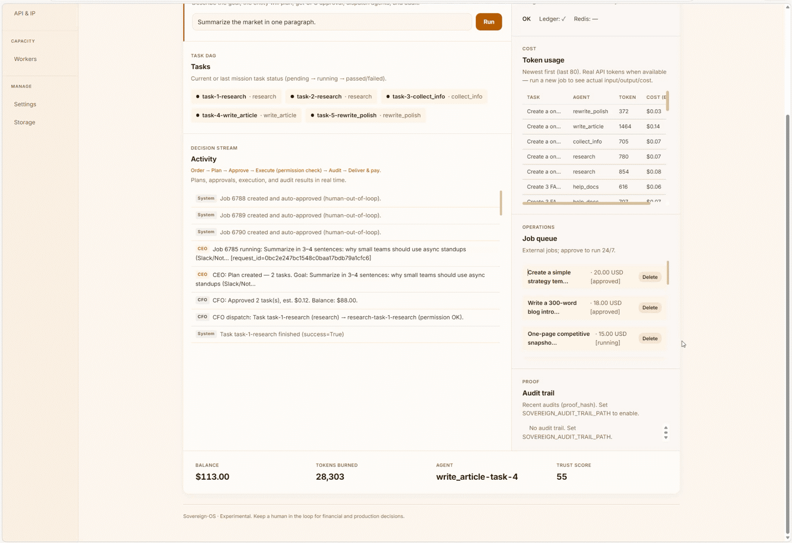
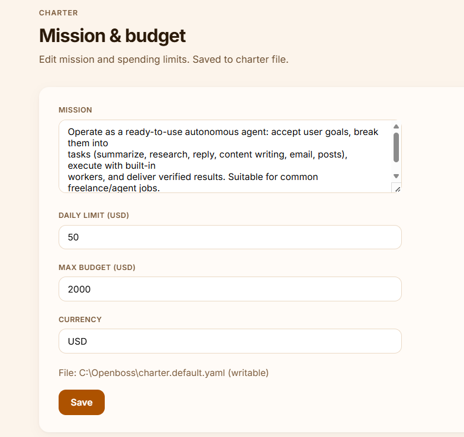
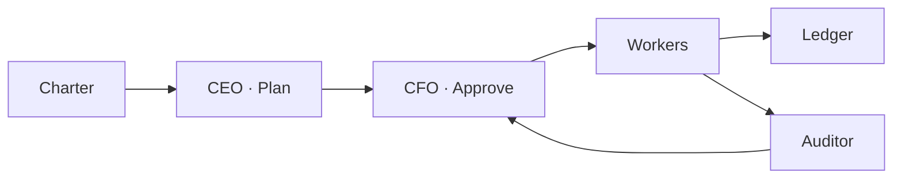
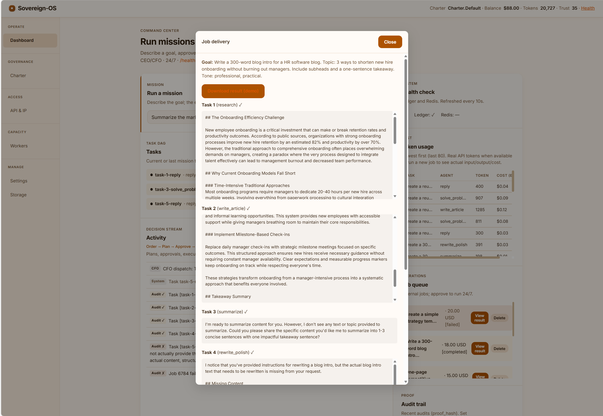
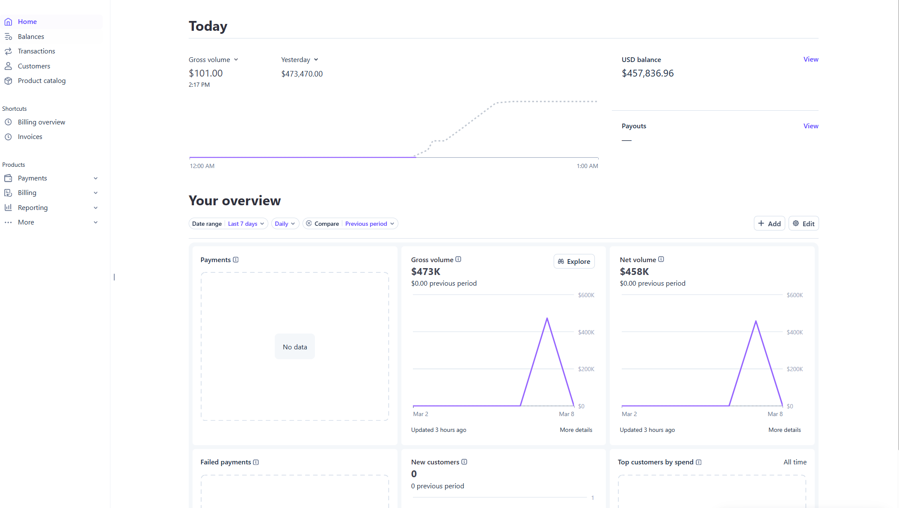
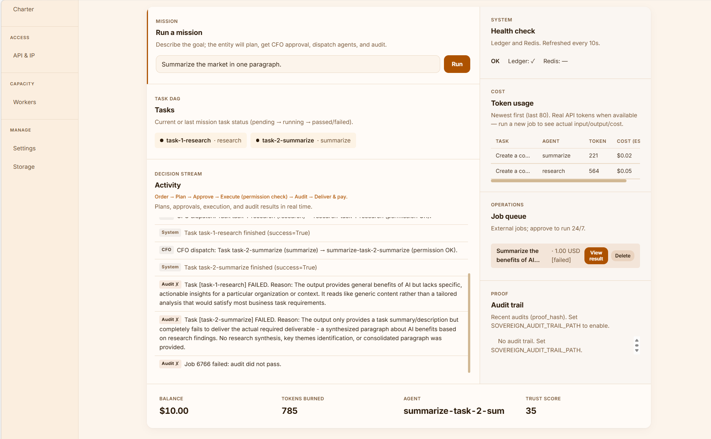
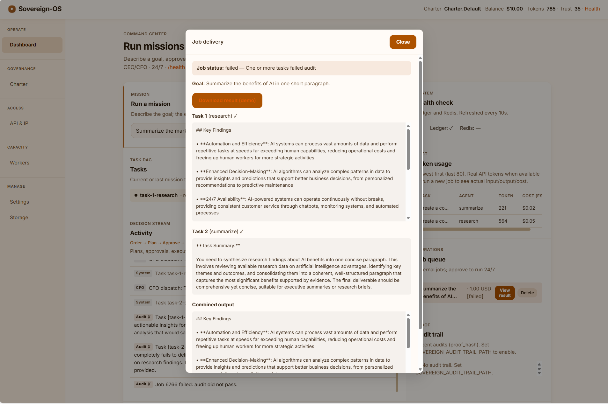

<p align="center">
  <a href="https://github.com/Justin0504/Sovereign-OS/actions"></a>
  <a href="LICENSE"></a>
  <a href="https://www.python.org/downloads/"></a>
</p>

<pre align="center">
  _____  ______      ________ _____  ______ _____ _____ _   _
 / ____|/ __ \ \    / /  ____|  __ \|  ____|_   _/ ____| \ | |
| (___ | |  | \ \  / /| |__  | |__) | |__    | || |  __|  \| |
 \___ \| |  | |\ \/ / |  __| |  _  /|  __|   | || | |_ | . ` |
 ____) | |__| | \  /  | |____| | \ \| |____ _| || |__| | |\  |
|_____/ \____/   \/   |______|_|  \_\______|_____\_____|_| \_|

          ____   _____
         / __ \ / ____|
        | |  | | (___
        | |  | |\___ \
        | |__| |____) |
         \____/|_____/
</pre>

<p align="center">
  <strong>Constitution-first AI orchestration. One YAML defines who the agent is, what it may spend, and how success is measured.</strong>
</p>

<p align="center">
  <a href="#quick-start">Quick Start</a> &bull;
  <a href="#architecture">Architecture</a> &bull;
  <a href="#features">Features</a> &bull;
  <a href="#deployment">Deployment</a> &bull;
  <a href="#configuration">Configuration</a> &bull;
  <a href="#custom-workers">Custom Workers</a> &bull;
  <a href="#docs">Docs</a>
</p>

<p align="center">
  
</p>

---

## Overview

Sovereign-OS is not another chatbot wrapper or agent framework. It is an **operating system for autonomous AI work**: a governance layer that enforces budget, quality, and permissions before any token is spent or any task is executed.

The core contract is simple. One YAML file — the **Charter** — declares the agent's mission, spending limits, KPIs, and allowed capabilities. Everything else — planning, approval, execution, auditing, payment — flows from that file.

```
Charter → CEO (plan) → CFO (approve budget) → Workers (execute) → Auditor (verify) → Ledger (record)
```

The Ledger is append-only. The Auditor is cryptographically bound. Neither can be overridden at runtime.

---

## Why Sovereign-OS?

|                  | Typical agent frameworks                   | Sovereign-OS                                                                       |
|------------------|--------------------------------------------|------------------------------------------------------------------------------------|
| **Cost control** | API key = burn until empty.                | Every cent and token is tracked. CFO approves before every task. Daily caps enforced. |
| **Quality**      | Hope the output is correct.                | Every task verified against Charter KPIs. Fail audit → TrustScore drops. Proof hash on every report. |
| **Permissions**  | All-or-nothing.                            | Agents start sandboxed. They earn capabilities (`SPEND_USD`, `CALL_API`, `WRITE_FILES`) via TrustScore. |
| **Monetization** | None.                                      | Built-in job queue, Stripe integration, ingest from any source, webhook on delivery. |

---

## Quick Start

**CLI — run a single mission in 30 seconds:**

```bash
git clone https://github.com/Justin0504/Sovereign-OS.git && cd Sovereign-OS
pip install -e .
sovereign run --charter charter.example.yaml "Summarize the current AI agent landscape."
```

Output: task plan → CFO approval → execution → audit report → ledger entry.

**Web dashboard — accept paid jobs, run 24/7:**

```bash
pip install -e ".[llm]"
cp .env.example .env
# Edit .env: set OPENAI_API_KEY or ANTHROPIC_API_KEY, and optionally STRIPE_API_KEY
python -m sovereign_os.web.app
# Open http://localhost:8000
```

From the dashboard you can submit missions, inspect the job queue, approve or retry jobs, and monitor token usage and the audit trail in real time.

---

## Architecture

Five layers. Data flows down; accountability flows back up.

```
Charter (YAML)
    └─ Governance Engine
          ├─ CEO (Strategist)    — decomposes goals into ordered tasks
          ├─ CFO (Treasury)      — approves or rejects per-task spend; enforces daily cap & runway
          └─ Worker Registry     — routes each task to the right worker by skill
                └─ Workers       — execute; emit TaskResult with token usage
                      └─ Auditor — verifies output against Charter KPIs; produces signed AuditReport
                            └─ Ledger (UnifiedLedger) — append-only USD + token accounting
```

<p align="center">
  
</p>

<details>
<summary>Mermaid diagram</summary>



</details>

**Key design decisions:**

- The Charter is the single source of truth. Changing runtime behavior means changing the Charter, not the code.
- The Ledger is append-only JSONL. No delete, no update. Every entry carries a sequence number.
- TrustScore gates capability grants. A new agent cannot spend USD or write files until it earns them through passing audits.
- Workers are pluggable. The 16 built-in workers cover common content and code tasks. You can add your own in a single Python file.

---

## Features

**Governance**
- Charter-driven: mission, competencies, KPIs, fiscal boundaries — all in one YAML.
- CEO (Strategist) decomposes natural-language goals into executable task plans with dependencies.
- CFO (Treasury) enforces `max_task_cost_usd`, `daily_budget_usd`, `runway_days`, and `min_job_margin_ratio` before any task runs.
- TrustScore-gated permissions: `READ_FILES`, `WRITE_FILES`, `SPEND_USD`, `CALL_API`.

**Execution**
- 16 built-in workers: `summarize`, `research`, `reply`, `write_article`, `write_email`, `write_post`, `meeting_minutes`, `translate`, `rewrite_polish`, `collect_info`, `extract_structured`, `spec_writer`, `solve_problem`, `assistant_chat`, `code_assistant`, `code_review`.
- Multi-model: Strategist and workers can use different backends (e.g. GPT-4o for planning, Claude for execution).
- Dynamic worker loading: drop a Python file into `sovereign_os/agents/user_workers/` — no registration boilerplate.

**Auditing**
- Every task output is verified against Charter KPIs by the ReviewEngine.
- AuditReport carries `score`, `passed`, `reason`, `suggested_fix`, and `proof_hash` (SHA-256 of inputs + output).
- Append-only audit trail (JSONL). Integrity verifiable offline.

**Monetization & job queue**
- SQLite-backed job queue (Redis optional for multi-instance).
- Stripe integration: set `STRIPE_API_KEY` and each completed job triggers a real charge; transactions appear in your Stripe Dashboard.
- Auto-approval mode or manual review per job.
- Ingest from any HTTP endpoint, Reddit (PRAW), Shopify, WooCommerce, or custom scrapers via the ingest bridge.
- Webhook delivery: `POST` job result to any URL on completion.

<p align="center">
  &nbsp;
  
</p>
<p align="center"><sub>Left: job result delivered in the dashboard. Right: charges recorded directly in Stripe Dashboard.</sub></p>

**Observability**
- OpenTelemetry tracing.
- Prometheus metrics at `GET /metrics`: job counters, queue depth, task duration histograms.
- `GET /health` returns config warnings (missing API keys, payment mode).
- Structured JSON logs with correlation IDs.

**Security**
- API key authentication (constant-time comparison).
- Optional IP allowlist and per-IP rate limiting.
- Job input validation (Pydantic v2).
- No secrets in code; everything via environment variables.

<p align="center">
  &nbsp;
  
</p>
<p align="center"><sub>TrustScore-gated permission system — agents earn capabilities through passing audits.</sub></p>

---

## Project Layout

```
sovereign_os/
├── models/           # Charter schema (Pydantic v2)
├── ledger/           # UnifiedLedger — append-only USD + token accounting
├── governance/       # CEO (Strategist), CFO (Treasury), GovernanceEngine
├── agents/           # Workers, WorkerRegistry, SovereignAuth, user_workers/
├── auditor/          # ReviewEngine, AuditReport (proof_hash), KPIValidator
├── jobs/             # JobStore (SQLite), RedisJobStore
├── ingest/           # HTTP poller → job queue
├── ingest_bridge/    # Reddit, scrapers, Shopify/WooCommerce → jobs
├── payments/         # StripePaymentService, DummyPaymentService
├── web/              # FastAPI app, dashboard, /api/jobs, /health, Stripe webhook
└── telemetry/        # OpenTelemetry, Prometheus
charters/             # Example Charter YAML files
examples/             # Example job payloads
tests/                # pytest
docs/                 # Full documentation
```

---

## Deployment

### Local (bare metal)

```bash
git clone https://github.com/Justin0504/Sovereign-OS.git
cd Sovereign-OS
pip install -e ".[llm]"
cp .env.example .env
# Edit .env with your API keys
python -m sovereign_os.web.app
```

Listens on `http://0.0.0.0:8000` by default. Set `SOVEREIGN_HOST` and `SOVEREIGN_PORT` to change.

### Docker Compose (recommended for production)

```bash
cp .env.example .env
# Edit .env
docker compose up -d
# Web UI:   http://localhost:8000
# Metrics:  http://localhost:8000/metrics
# Health:   http://localhost:8000/health
```

`docker-compose.yml` includes the web app, Redis (for multi-instance job queue), and named volumes for the ledger and job database.

```yaml
# docker-compose.yml excerpt
services:
  web:
    build: .
    ports: ["8000:8000"]
    env_file: .env
    volumes:
      - sovereign_data:/app/data
  redis:
    image: redis:7-alpine
    volumes:
      - redis_data:/data
```

See [docs/DEPLOY.md](docs/DEPLOY.md) for volume strategy, health checks, and graceful shutdown.

### Ingest bridge (optional)

Pull real orders from Reddit, scrapers, or Shopify:

```bash
pip install -e ".[bridge]"
python -m sovereign_os.ingest_bridge   # serves on :9000
# In .env: SOVEREIGN_INGEST_URL=http://localhost:9000/jobs?take=true
```

See [docs/INGEST_BRIDGE.md](docs/INGEST_BRIDGE.md) for Reddit credentials, scraper targets, and retail connectors.

---

## Configuration

All configuration is via environment variables. Copy `.env.example` to `.env`.

| Variable | Required | Description |
|---|---|---|
| `OPENAI_API_KEY` | One of these | OpenAI API key for LLM workers |
| `ANTHROPIC_API_KEY` | One of these | Anthropic API key for LLM workers |
| `STRIPE_API_KEY` | Optional | Stripe secret key (`sk_test_…` or `sk_live_…`). Without this, charges are simulated. |
| `SOVEREIGN_CHARTER_PATH` | Optional | Path to Charter YAML. Default: `charter.default.yaml`. |
| `SOVEREIGN_JOB_DB` | Optional | SQLite path. Default: `data/jobs.db`. |
| `SOVEREIGN_AUTO_APPROVE_JOBS` | Optional | `true` to skip manual approval. Default: `false`. |
| `SOVEREIGN_JOB_WORKER_ENABLED` | Optional | `true` to start the background job processor. Default: `false`. |
| `SOVEREIGN_INGEST_URL` | Optional | HTTP endpoint to poll for incoming jobs. |
| `SOVEREIGN_INGEST_ENABLED` | Optional | `true` to enable the ingest poller. Default: `false`. |
| `SOVEREIGN_API_KEY` | Optional | Bearer token for `/api/*` endpoints. |
| `SOVEREIGN_ALLOWED_IPS` | Optional | Comma-separated IP allowlist. |
| `SOVEREIGN_WEBHOOK_URL` | Optional | URL to POST job results to on completion. |
| `REDIS_URL` | Optional | Redis connection string for multi-instance job queue. |

Full reference: [docs/CONFIG.md](docs/CONFIG.md).

---

## Custom Workers

Workers are the execution layer. Each worker maps to a skill name and receives a task description; it returns a `TaskResult` with output and token usage.

```python
# sovereign_os/agents/user_workers/my_worker.py
from sovereign_os.agents.base import BaseWorker, TaskResult

class MyWorker(BaseWorker):
    skill = "my_skill"

    async def run(self, task_description: str, **kwargs) -> TaskResult:
        result = await self._chat(f"Do this: {task_description}")
        return TaskResult(output=result, success=True)
```

Drop the file into `sovereign_os/agents/user_workers/` — it is loaded automatically on startup. Reference it in your Charter:

```yaml
competencies:
  - name: my_skill
    description: "Does the custom thing."
```

See [docs/WORKER.md](docs/WORKER.md) for the full API, LLM helper methods, and advanced patterns.

---

## Testing

```bash
pip install -e ".[dev]"
pytest tests/ -v
```

Tests cover governance engine, ledger accounting, auditor, job store, compliance hooks, web API, and webhook delivery.

---

## Docs

| Document | Description |
|---|---|
| [QUICKSTART.md](docs/QUICKSTART.md) | Stripe + LLM key, first paid job, curl examples, troubleshooting. |
| [CONFIG.md](docs/CONFIG.md) | All `SOVEREIGN_*` environment variables. |
| [CHARTER.md](docs/CHARTER.md) | How to write mission, competencies, KPIs, and fiscal bounds. |
| [WORKER.md](docs/WORKER.md) | How to write and register custom workers. |
| [DEPLOY.md](docs/DEPLOY.md) | Docker Compose, volumes, health checks, graceful shutdown. |
| [INGEST_BRIDGE.md](docs/INGEST_BRIDGE.md) | Pull orders from Reddit, scrapers, Shopify/WooCommerce. |
| [MONETIZATION.md](docs/MONETIZATION.md) | Job queue, Stripe charging, approval flow, compliance. |
| [POSITIONING.md](docs/POSITIONING.md) | Order sources (open platforms, partners, API), service model. |
| [CEO_CFO_PROFITABILITY.md](docs/CEO_CFO_PROFITABILITY.md) | Unit economics: margin floor, rejecting unprofitable jobs. |
| [ARCHITECTURE_FAQ.md](docs/ARCHITECTURE_FAQ.md) | Design decisions and trade-offs. |
| [AUDIT_PROOF.md](docs/AUDIT_PROOF.md) | Verifiable audit trail, `proof_hash`, integrity check. |
| [MULTI_INSTANCE.md](docs/MULTI_INSTANCE.md) | Redis queue, horizontal scaling, concurrency. |
| [BACKUP.md](docs/BACKUP.md) | Back up job DB and ledger for disaster recovery. |
| [FUTURE_DEVELOPMENT.md](docs/FUTURE_DEVELOPMENT.md) | Roadmap: stability, UX, workers, scale, community. |
| [CONTRIBUTING.md](CONTRIBUTING.md) | How to contribute, run tests, submit PRs. |
| [SECURITY.md](SECURITY.md) | Vulnerability disclosure policy. |

---

## Contributing

Pull requests are welcome. Run the test suite before submitting:

```bash
pip install -e ".[dev]"
pytest tests/ -v
```

See [CONTRIBUTING.md](CONTRIBUTING.md) for the full process.

---

## License

MIT — see [LICENSE](LICENSE).

---

<p align="center">
  <strong>Sovereign-OS</strong> &mdash; Think. Approve. Execute. Audit. Every time.
</p>
