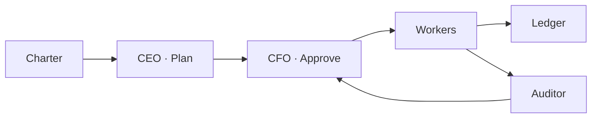

<p align="center">
  <a href="https://github.com/Justin0504/Sovereign-OS/actions"></a>
  <a href="LICENSE"></a>
  <a href="https://www.python.org/downloads/"></a>
</p>

<pre align="center">
 ███████╗ ██████╗ ██╗   ██╗███████╗██████╗ ███████╗██╗ ██████╗ ███╗   ██╗
 ██╔════╝██╔═══██╗██║   ██║██╔════╝██╔══██╗██╔════╝██║██╔═══██╗████╗  ██║
 ███████╗██║   ██║██║   ██║█████╗  ██████╔╝█████╗  ██║██║   ██║██╔██╗ ██║
 ╚════██║██║   ██║╚██╗ ██╔╝██╔══╝  ██╔══██╗██╔══╝  ██║██║   ██║██║╚██╗██║
 ███████║╚██████╔╝ ╚████╔╝ ███████╗██║  ██║██║     ██║╚██████╔╝██║ ╚████║
 ╚══════╝ ╚═════╝   ╚═══╝  ╚══════╝╚═╝  ╚═╝╚═╝     ╚═╝ ╚═════╝ ╚═╝  ╚═══╝
      ██████╗ ███████╗
     ██╔═══██╗██╔════╝
     ██║   ██║███████╗
     ██║   ██║╚════██║
     ╚██████╔╝███████║
      ╚═════╝ ╚══════╝
</pre>

# Sovereign-OS

**One command. One Charter. A digital corporation that thinks, spends, and answers for every token.**

Not another chatbot. Not another “AI agent framework.” Sovereign-OS is the **constitution-first substrate**: one YAML defines who the entity is, what it may spend, and how success is measured. The CEO plans. The CFO gates. The Auditor judges. **The Ledger never lies.**

<p align="center">
  <a href="#-quick-start">Quick Start</a> •
  <a href="#-why-sovereign-os">Why</a> •
  <a href="#-architecture">Architecture</a> •
  <a href="#-features">Features</a> •
  <a href="#-docs">Docs</a>
</p>

---

## ⚡ Quick Start

**CLI — 30 seconds:**

```bash
git clone https://github.com/Justin0504/Sovereign-OS.git && cd Sovereign-OS
pip install -e .
sovereign run --charter charter.example.yaml "Summarize the market in one paragraph."
```

You get: task plan → CFO approval → execution → audit report. Done.

**Web Dashboard — paid jobs, 24/7:**

```bash
pip install -e ".[llm]"
# Set STRIPE_API_KEY + OPENAI_API_KEY or ANTHROPIC_API_KEY in .env
python -m sovereign_os.web.app
# Open http://localhost:8000 — run missions, approve jobs, watch balance & token usage.
```

**Want to charge for work?** [3-step guide →](docs/QUICKSTART.md) (Stripe + one LLM key; 13 built-in workers out of the box.)

---

## 🧠 Why Sovereign-OS?

| | **Typical agent frameworks** | **Sovereign-OS** |
|---|---|---|
| **💰 Money** | API key = burn until empty. | **Real ledger.** Every cent and token tracked. CFO approves before every task. Daily caps, runway, P&L. |
| **🛡️ Quality** | Hope the output is right. | **Audited.** Every task verified against Charter KPIs. Fail audit → TrustScore drops. Proof hash on every report. |
| **⚖️ Control** | All or nothing. | **Earned.** Agents start in a sandbox. They *earn* spend and capabilities via TrustScore. |

One YAML = mission, budget, and rules. The rest is governance.

---

## 🏛️ Architecture

Five layers. Data flows down; accountability flows back.

```
Charter (who we are) → Governance (CEO + CFO) → Registry (workers) → Ledger (every $ & token) → Auditor (pass/fail → TrustScore)
```

- **Charter** — Mission, competencies, fiscal bounds, KPIs. One file.
- **Governance** — CEO decomposes goals into tasks; CFO approves or denies budget per task.
- **Registry** — Maps skills to workers (13 built-in: summarize, research, reply, write_article, translate, …).
- **Ledger** — Append-only. Runway, burn rate, income. Never lies.
- **Auditor** — KPI verification. Pass → TrustScore ↑. Fail → TrustScore ↓.

<details>
<summary><b>Diagram & roadmap</b></summary>



Phases 1–6a done (governance, ledger, MCP, audit trail, Stripe, webhook). Phase 6b: on-chain/compliance stubs. See [PHASE6](docs/PHASE6.md) and [OPTIMIZATION_ROADMAP](docs/OPTIMIZATION_ROADMAP.md).

</details>

---

## 🚀 Features

- **📦 13 built-in workers** — summarize, research, reply, write_article, solve_problem, write_email, write_post, meeting_minutes, translate, rewrite_polish, collect_info, extract_structured, spec_writer. No code; configure Stripe + one LLM key and run paid jobs. [QUICKSTART](docs/QUICKSTART.md)
- **🔄 Multi-model** — Strategist and workers can use different backends (e.g. GPT-4o for planning, cheaper models for execution).
- **🔐 SovereignAuth** — RBAC by TrustScore. READ_FILES, WRITE_FILES, SPEND_USD, CALL_API gated; agents earn capabilities.
- **🌐 Web Dashboard (24/7)** — Run missions, job queue, approve/retry, health, token usage, audit trail. Optional ingest from URL; Stripe charges; webhook on completion.
- **🔌 MCP native** — Plug into the same tool graph as the rest of the ecosystem.
- **📊 Observability** — OpenTelemetry, Prometheus metrics, verifiable audit trail with `proof_hash`.

---

## 📁 Project layout

```
sovereign_os/
├── models/       # Charter (Pydantic)
├── ledger/       # UnifiedLedger (cents + tokens)
├── governance/   # CEO (Strategist) + CFO (Treasury) + Engine
├── agents/       # Workers, Registry, SovereignAuth
├── auditor/      # ReviewEngine, AuditReport (proof_hash)
├── jobs/         # JobStore (SQLite queue)
├── ingest/       # Poll URL → enqueue jobs
├── web/          # FastAPI dashboard, /api/jobs, /health, Stripe webhook
└── ui/           # Textual TUI (optional)
docs/             # QUICKSTART, CONFIG, CHARTER, WORKER, MONETIZATION, …
tests/            # pytest
```

---

## 📖 Docs

| Doc | What’s inside |
|-----|----------------|
| [**Quick Start**](docs/QUICKSTART.md) | Stripe + LLM key, first paid job, curl examples, troubleshooting. |
| [Config & env](docs/CONFIG.md) | All `SOVEREIGN_*`, Stripe, Redis, webhook, rate limit, retry. |
| [Charter](docs/CHARTER.md) | How to write mission, competencies, KPIs, fiscal bounds. |
| [Worker](docs/WORKER.md) | How to add and register custom workers. |
| [Monetization](docs/MONETIZATION.md) | Job queue, Stripe, approval, compliance, human-out-of-loop. |
| [Audit proof](docs/AUDIT_PROOF.md) | Verifiable trail, `proof_hash`, integrity check. |
| [Optimization roadmap](docs/OPTIMIZATION_ROADMAP.md) | Next steps: reliability, observability, security, scale. |

---

## 🧪 Test & run

```bash
pip install -e ".[dev]"
pytest tests/ -v
```

**Docker (Web UI + Redis):**

```bash
docker compose up -d redis web
# http://localhost:8000
```

**Troubleshooting:** Payments still “Dummy” or no real LLM? Set `STRIPE_API_KEY` and `OPENAI_API_KEY` or `ANTHROPIC_API_KEY` in `.env`; restart. Check `GET /health` for `config_warnings`. [QUICKSTART](docs/QUICKSTART.md).

---

## 🔒 Security & contributing

- **Secrets:** Use env vars only (e.g. `STRIPE_API_KEY`, `OPENAI_API_KEY`). [CONFIG](docs/CONFIG.md).
- **Vulnerabilities:** [SECURITY.md](SECURITY.md).
- **Contribute:** [CONTRIBUTING.md](CONTRIBUTING.md). Run tests before PR.

## 📜 License

**MIT**

---

<p align="center">
  <strong>Sovereign-OS</strong> — Think. Audit. Execute.
</p>
<p align="center">
  <sub>If you run a digital corp, run it on a ledger.</sub>
</p>
